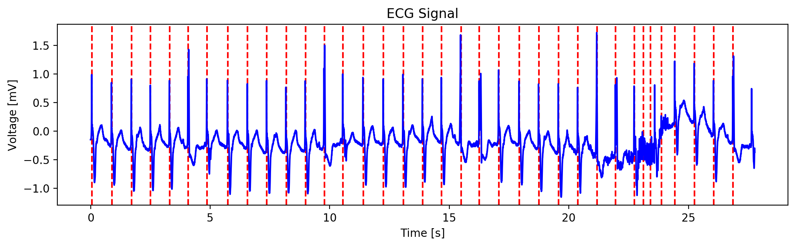

# HRMonitor

## Heart Rate Monitor Post-Processing

[](https://travis-ci.org/rvshi/bme590hrm) [](https://hrmonitor.readthedocs.io/en/latest/?badge=latest)


__Developed By:__ Harvey Shi (@rvshi)

__Course:__ Duke BME 590-05 Medical Software Design (Spring 2018)


## Overview

This project defines a Python 3 class, `HRMonitor`, for processing ECG data.
- In order to parse the data, a custom `DataHandler` class is used, to allow further extensibility in the future.
- After being parsed, the data is analyzed internally by the module to determine useful attributes such as heart rate or duration of signal.
- For more detailed information on the individual class methods, see the [documentation site](https://hrmonitor.readthedocs.io/en/latest/?badge=latest).
## Usage

- First, you want to [set up a Python virtual environment](https://docs.python.org/3/tutorial/venv.html) and install the packages in `requirements.txt`.
- Next, you can import the `HRmonitor` class from `hrmonitor.py` and start using this module in your code.
- Here is a basic example of usage, which you can run from the root directory of this repo:

```python
from hrmonitor import HRMonitor
hr = HRMonitor('./test_data/test_data5.csv')
hr.plot_data()
```
Which produces the following files:

`./test_data/test_data5.json`:
```json
{
    "peak_interval": 0.808,
    "mean_hr_bpm": [74.25743, 73.71007],
    "voltage_extremes": [-1.155, 1.72],
    "duration": 27.775,
    "num_beats": 36,
    "beats": [0.061, 0.886, 1.714, 2.511, 3.306, 4.081, 4.869, 5.736, 6.564, 7.372, 8.181, 8.986, 9.772, 10.556, 11.403, 12.25, 13.075, 13.886, 14.678, 15.489, 16.258, 17.072, 17.928, 18.742, 19.569, 20.378, 21.178, 21.958, 22.742, 23.111, 23.411, 23.875, 24.436, 25.253, 26.058, 26.867]
}
```
`./test_data/test_data5.png`:


### Some important usage notes
- Input ECG data should be in `.csv` format.
- Only two float values should be present on each line of the `.csv`, in this order: `time, voltage`.
- Time units are assumed to be continuous, i.e. with roughly the same interval between every time entry.
- Example ECG files can be found in the `test_data/` directory.
- The data units can be specified by setting the `time_units` and `voltage_units` arguments in the HRMonitor constructor function.
    - The default units are seconds and mV.
    - `time_units` is a float representing the new unit of time in terms of seconds.
    - `voltage_units` is a float representing the new unit of time in terms of seconds.
    - For example, if the units were milliseconds and volts, you would specify this as:
```python
HRMonitor('./file.csv', time_units = 0.001, voltage_units = 1000)
```

## Features
- Calculates several class attributes from the data:
  - `time`: numpy vector of the time data
  - `voltage`: numpy vector of the voltage data
  - `peak_interval`: interval between all peaks in the signal, as estimated via autocorrelation of the signal (in seconds)
  - `mean_hr_bpm`: numpy vector containing the average heart rate (in bpm) for contiguous bins with a size specified by the user
    - default chunk size is 10 seconds
    - calculated by obtaining `peak_interval` over chunks of the data
    - this can be recalculated by running the `get_mean_hr(<window_size>)` function, where `window_size` is the size of the chunks in seconds
  - `voltage_extremes`: tuple of the (min, max) of the voltage data
  - `duration`: total length of the signal in seconds
  - `beats`: numpy array with the approximate time locations of heart beats via peak detection following a bandpass filter
  - `num_beats`: estimated number of beats in the data, taken as the length of `beats`
- Ensures that the input data is consistent to the (time, voltage) format.
    - Makes sure that the data consists of pairs of floats.
    - Performs interpolation for pairs with missing or invalid values.
- Exports some calculated attributes as a JSON file with the same name as the input `.csv`.
    - `time` and `voltage` are not exported since they are already in archival format.
- Can be used to generate plots of the data using the `plot_data()` method.

## Other notes
The current module has only been tested with Python 3.6.4 on MacOS 10.13
